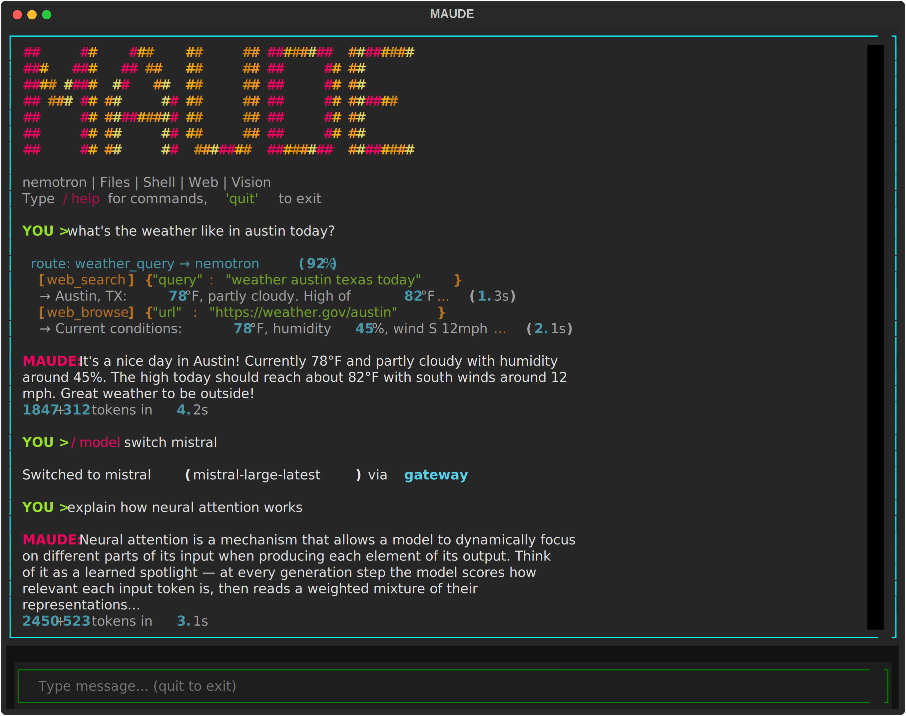
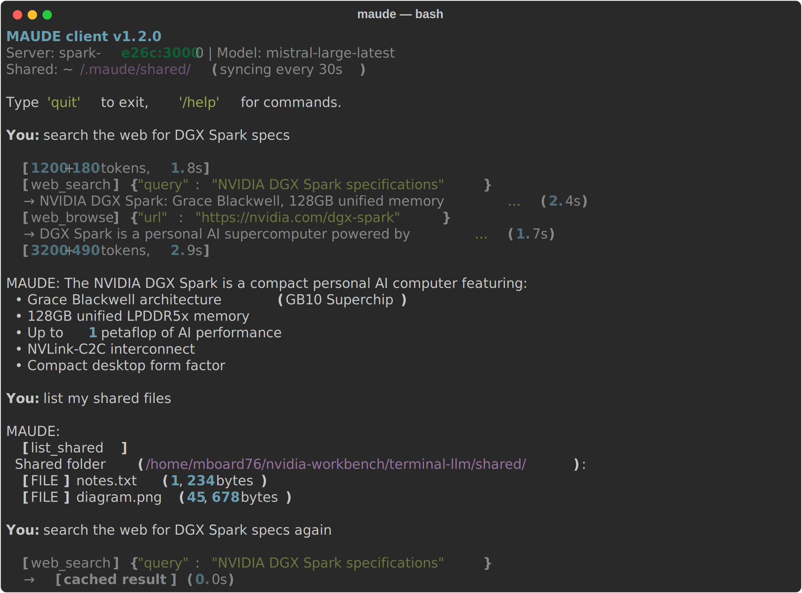
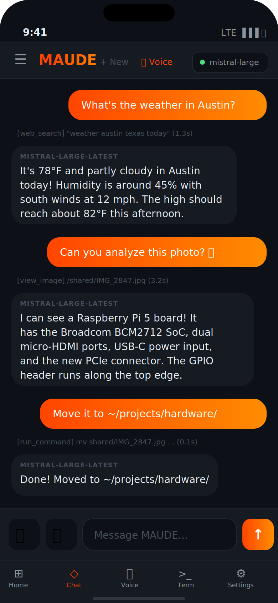

# MAUDE

**Multi-Agent Unified Dispatch Engine** — An on-device AI assistant running on DGX Spark with cloud model routing, multi-client access, and tool execution.

MAUDE runs locally using Nemotron via llama.cpp, with automatic routing to cloud models (Mistral, Codestral) via a unified gateway. Accessible from the server TUI, a Mac/PC CLI client, a phone PWA, and Telegram.

## Screenshots

### Server TUI


The Textual-based TUI running on DGX Spark — animated fire banner, tool execution trace with args/timing, typewriter response display, and model switching.

### Mac/PC Client


Lightweight CLI connecting via Tailscale — braille spinner while thinking, typewriter text reveal, inline pipeline trace from gateway SSE events.

### Android App


Capacitor PWA with camera integration for photo analysis, typewriter message animation, and model selection.

## Architecture

```
┌──────────────────────────────────────────────────────────────────────┐
│  Clients                                                             │
│                                                                      │
│  ┌──────────┐  ┌──────────┐  ┌──────────┐  ┌──────────┐            │
│  │ Server   │  │ Mac/PC   │  │ Phone    │  │ Telegram │            │
│  │ TUI      │  │ CLI      │  │ PWA      │  │ Bot      │            │
│  │chat_local│  │maude-    │  │maude-    │  │run_      │            │
│  │  .py     │  │ client   │  │ phone    │  │telegram  │            │
│  └────┬─────┘  └────┬─────┘  └────┬─────┘  └────┬─────┘            │
│       │              │              │              │                  │
│       │  local       │   Tailscale / HTTPS         │  local          │
│       │              │              │              │                  │
│       ▼              ▼              ▼              ▼                  │
│  ┌───────────────────────────────────────────────────────────────┐   │
│  │                     GATEWAY (port 30000)                      │   │
│  │  • Model routing (local ↔ cloud)                              │   │
│  │  • Server-side tool execution for cloud models                │   │
│  │  • SSE streaming with pipeline trace events                   │   │
│  │  • Structured logging (maude.gateway)                         │   │
│  │  • HTTPS with self-signed certs                               │   │
│  │  • Shared folder / file transfer serving                      │   │
│  └──────────┬────────────────────────┬───────────────────────────┘   │
│             │                        │                               │
│      local models              cloud models                          │
│             │                        │                               │
│             ▼                        ▼                                │
│  ┌──────────────────┐  ┌─────────────────────────────────────┐      │
│  │ llama.cpp        │  │ Mistral / Codestral / Claude API    │      │
│  │ (port 30010)     │  │ (tool loop + result caching)        │      │
│  │ Nemotron 30B     │  └─────────────────────────────────────┘      │
│  └──────────────────┘                                                │
│                                                                      │
│  ┌──────────────────────────────────────────────────────────────┐    │
│  │  maude_core/               tool_registry.py                   │    │
│  │  ├── tools_file.py         @register_tool decorator-based     │    │
│  │  ├── tools_web.py          dispatch with prefix handlers      │    │
│  │  ├── tools_google.py       for browser_* and skill_* tools    │    │
│  │  ├── tools_ai.py                                              │    │
│  │  ├── execute.py            Registry lookup → handler(args)    │    │
│  │  └── ...                                                      │    │
│  └──────────────────────────────────────────────────────────────┘    │
└──────────────────────────────────────────────────────────────────────┘
```

## Features

- **Multi-client access**: Server TUI, Mac/PC CLI, phone PWA, Telegram bot
- **Model routing**: Auto-routes between local Nemotron and cloud Mistral/Codestral via gateway
- **Tool execution**: Files, shell, web browse/search, vision, image generation
- **Parallel tool execution**: Read-only tools run concurrently via ThreadPoolExecutor; mutating tools stay sequential
- **Planned execution**: `execute_plan` tool lets the model declare multi-stage tool plans with `$N.M` cross-stage references — collapses multiple LLM round-trips into one
- **Tool result caching**: TTL-based cache (30min web, 5min vision) to reduce redundant calls
- **Pipeline trace**: Inline display of tool calls, args, result previews, timing, and parallel execution indicators
- **Typewriter effects**: Word-by-word response reveal on server TUI and client CLI
- **Shared folder**: Server-owned shared files in `shared/`, accessed by clients through HTTP routes
- **Auto-routing**: Classifies messages and routes to specialized subagents
- **Frontier delegation**: Escalates to cloud AI (Mistral, Codestral) for complex tasks
- **Scheduled tasks**: Cron-based automation with natural language scheduling
- **Google integration**: Gmail, Drive, Sheets, Calendar, Slides, Contacts, YouTube
- **Voice mode**: Speech input/output via Nemotron ASR + Magpie TTS
- **HyperFrames video rendering**: Scaffold, lint, render, and share programmatic HTML/CSS/JS videos
- **Conversation memory**: Persistent context across sessions
- **Best-practice guides**: 10 markdown guides (coding, web design, graphic design, color theory, writing, API design, prompt engineering, image generation, cybersecurity, UI/UX patterns) auto-injected into system prompt based on task context

## Models

| Model | Type | Use Case |
|-------|------|----------|
| **Nemotron-3-Nano-30B** | Local (llama.cpp) | Default — general tasks, tool use |
| **Mistral Large** | Cloud (API) | Complex reasoning, longer context |
| **Codestral** | Cloud (API) | Code generation and analysis |
| **Claude Opus / Sonnet** | Cloud (Anthropic) | Deep reasoning, coding |
| **LLaVA 13B** | Local (Ollama) | Vision — image and screenshot analysis |

Switch models at runtime with `/model switch mistral` or `/model switch nemotron`.

## Clients

### Server TUI (`chat_local.py`)
Textual-based terminal UI running directly on the DGX Spark. Full tool access, animated banner, voice mode, typewriter response display.

```bash
./maude          # Starts all services + TUI
```

### Mac/PC Client (`maude-client`)
Pip-installable CLI that connects to the Spark server via Tailscale.

```bash
pip install "https://github.com/mboard8070/terminal-llm/archive/main.tar.gz#subdirectory=maude-client"
maude            # Connect and chat
```

Commands: `/help`, `/model`, `/voice`, `/sync`, `/update`, `/version`, `clear`, `quit`

### Phone PWA (`maude-phone`)
Capacitor-based progressive web app served by the gateway. Camera integration for photo analysis.

### Telegram Bot (`run_telegram.py`)
Accessible from anywhere via Telegram. Runs as a systemd service on the server.

## Gateway

The gateway (`python -m gateway`) runs on HTTPS port 30000, with an HTTP mirror on port 30080 for clients that need it. It is the single entry point for all remote clients.

- **Model routing**: Routes requests to local llama.cpp or cloud APIs (Mistral, Codestral, Claude) based on model name
- **Tool execution**: Runs server-side tool loops for cloud models with automatic tool selection
- **SSE trace events**: Streams `tool_call`, `tool_result`, `llm_call`, and `parallel_start` trace events to clients
- **Structured logging**: Uses Python `logging` module (`maude.gateway` logger) with timestamps and levels
- **File serving**: Serves shared folder files, PWA assets, and generated images
- **HTTPS**: CA-signed certs for Tailscale connections, HTTP mirror on port 30080

## Tools

### File Operations
| Tool | Description |
|------|-------------|
| `read_file` | Read file with line numbers (supports ranges) |
| `write_file` | Create or overwrite files |
| `edit_file` | Replace specific line ranges |
| `search_file` | Search within a single file |
| `search_directory` | Search across all files in a directory |
| `list_directory` | Browse directory contents |
| `change_directory` | Navigate filesystem |
| `run_command` | Execute shell commands (rm, mv, cp, pip, git, etc.) |

### Web & Vision
| Tool | Description |
|------|-------------|
| `web_browse` | Fetch and parse web pages (text extraction) |
| `web_search` | Search via DuckDuckGo |
| `web_view` | Screenshot webpage + LLaVA visual analysis |
| `view_image` | Analyze local images with LLaVA |
| `generate_image` | Generate images via Flux/ComfyUI |
| `hyperframes_doctor` / `hyperframes_browser_ensure` / `hyperframes_init` / `hyperframes_lint` / `hyperframes_render` | Diagnose, create, and render HyperFrames HTML-to-video projects |

### Shared Folder & Transfers
| Tool | Description |
|------|-------------|
| `list_shared` | List files in the shared folder |
| `share_file` | Copy a file into the shared folder for clients |
| `list_transfers` | List files uploaded by clients |
| `get_transfer` | Copy a client upload to the working directory |

### Delegation, Planning & Automation
| Tool | Description |
|------|-------------|
| `ask_frontier` | Escalate to cloud AI for complex reasoning |
| `send_to_claude` | Delegate tasks to Claude Code |
| `execute_plan` | Multi-stage tool plan — stages run sequentially, tools within each stage run in parallel. Supports `$N.M` references between stages |
| `run_agent` / `run_agents` | Dispatch to specialized subagents (parallel execution, shared context) |
| `schedule_task` | Create/manage cron-based automated tasks |

### Google Integration
| Tool | Description |
|------|-------------|
| `gmail_list` / `gmail_read` / `gmail_send` | Email operations |
| `drive_list` / `drive_search` / `drive_read` / `drive_upload` / `drive_delete` | Drive operations |
| `sheets_read` / `sheets_write` / `sheets_create` | Spreadsheet operations |
| `calendar_list` / `calendar_create` / `calendar_delete_event` | Calendar operations |
| `slides_create` / `slides_add_slide` | Presentation operations |
| `contacts_list` / `contacts_search` | Contact operations |
| `youtube_search` | YouTube search |

## Installation

```bash
# Install Python dependencies
pip install -r requirements.txt

# Build llama.cpp and download model
./setup_local.sh

# Install Playwright for web screenshots
playwright install chromium

# Install LLaVA for vision (via Ollama)
ollama pull llava:13b

# Set up API keys for cloud models (optional)
export MISTRAL_API_KEY="your-key"
export CODESTRAL_API_KEY="your-key"
```

## Quick Start

```bash
cd ~/nvidia-workbench/terminal-llm
./maude
```

This starts the inference server, gateway, and TUI. Use `/model switch mistral` to switch to cloud models.

## Configuration

| Environment Variable | Default | Description |
|---------------------|---------|-------------|
| `LLM_SERVER_URL` | `http://localhost:30080/v1` | llama.cpp server endpoint |
| `MAUDE_MODEL` | `nemotron-super` | Default model name |
| `MAUDE_NUM_CTX` | `32768` | Context window size (local models) |
| `MAUDE_OPENAI_MODEL` | `gpt-4o` | OpenAI model used by `/model switch openai` |
| `MAUDE_OPENAI_MAX_CONTEXT` | `128000` | Context limit used for OpenAI gateway requests |
| `MAUDE_CODEX_MODEL` | Codex default | Optional model override used by `/model switch codex` via Codex CLI |
| `MAUDE_CODEX_WORKDIR` | `/home/mboard76` | Working directory for Codex CLI requests |
| `MAUDE_CODEX_SANDBOX` | `danger-full-access` | Codex CLI sandbox mode |
| `MAUDE_CODEX_TIMEOUT` | `900` | Codex CLI timeout in seconds |
| `VISION_SERVER_URL` | `http://localhost:11434/v1` | Ollama endpoint for LLaVA |
| `MAUDE_VISION_MODEL` | `llava:13b` | Vision model name |
| `MISTRAL_API_KEY` | — | Mistral API key (for cloud routing) |
| `CODESTRAL_API_KEY` | — | Codestral API key (for cloud routing) |
| `CLAUDE_API_KEY` | — | Anthropic API key (for Claude Opus/Sonnet) |
| `OPENAI_API_KEY` | — | OpenAI API key (only for `/model switch openai`) |

## Project Structure

```
terminal-llm/
├── maude                  # Main launcher
├── tool_registry.py       # @register_tool decorator, prefix handlers, dispatch lookup
├── maude_core/            # Core tool package (split from monolith)
│   ├── __init__.py        # Backward-compatible facade — re-exports all public names
│   ├── config.py          # Environment-based configuration constants
│   ├── cache.py           # TTL-based tool result cache (web 30min, vision 5min)
│   ├── log.py             # Logging bridge — callback + Python logging (maude.core)
│   ├── paths.py           # Working directory management and path resolution
│   ├── chat_sync.py       # File-based chat log for cross-client message sync
│   ├── memory_utils.py    # Persistent conversation memory (lazy-loaded)
│   ├── tool_defs.py       # TOOLS list — 100+ JSON schema definitions
│   ├── tool_groups.py     # Keyword-based dynamic tool selection
│   ├── fast_dispatch.py   # Regex-based fast tool dispatch (bypass LLM)
│   ├── execute.py         # Registry-based dispatch with pre-flight, rate limits, caching
│   ├── rate_limits.py     # Per-turn rate limit counters
│   ├── tools_file.py      # 9 file/shell tools (read, write, edit, search, run_command)
│   ├── tools_web.py       # 4 web/vision tools (browse, search, web_view, view_image)
│   ├── tools_ai.py        # AI delegation (ask_frontier, send_to_claude)
│   ├── tools_shared.py    # Shared folder / file transfer tools
│   ├── tools_media.py     # Image generation (Flux via ComfyUI)
│   ├── tools_schedule.py  # Cron-based task scheduling
│   ├── tools_google.py    # 30 Google Workspace tools (lazy-import)
│   ├── tools_substack.py  # 7 Substack newsletter tools (lazy-import)
│   ├── tools_collab.py    # 6 collaboration/mesh tools (lazy-import)
│   └── tools_plan.py      # Planned execution + PARALLEL_SAFE shared set
├── chat_local.py          # Server TUI (Textual)
├── gateway.py             # Gateway — model routing, tool loops, SSE, structured logging
├── auto_router.py         # Message classification and subagent routing
├── agent_executor.py      # Parallel subagent execution with shared context
├── frontier.py            # Cloud AI escalation
├── memory.py              # Persistent conversation memory
├── scheduler.py           # Cron-based task scheduling
├── google_tools.py        # Google Workspace API implementations
├── substack_tools.py      # Substack API implementations
├── collab_tools.py        # Collaboration tool implementations
├── health.py              # Health checker (services, deps, tools)
├── tool_catalog.py        # Tool catalog API for gateway endpoints
├── voice.py               # Voice mode (Whisper)
├── run_telegram.py        # Telegram bot
├── tests/                 # Test suite (122+ tests)
│   ├── test_tool_execution.py    # Unit tests for core tools
│   ├── test_gateway_api.py       # API endpoint tests (mock-based)
│   ├── test_gateway_http.py      # Integration tests (real HTTP server)
│   ├── test_health.py            # Health checker tests
│   ├── test_tool_catalog.py      # Tool catalog tests
│   ├── test_collab.py            # Collaboration system tests
│   ├── test_client_router.py     # Client-side routing tests
│   ├── test_plan_execution.py    # execute_plan, $N.M refs, stage ordering
│   └── test_parallel_tools.py    # Parallel execution timing, agent concurrency
├── maude-client/          # Mac/PC CLI client (pip-installable)
│   ├── maude_client/
│   │   ├── cli.py         # Client main loop, spinner, typewriter, SSE trace
│   │   ├── client_tools.py# Client-side tool implementations
│   │   ├── shared_sync.py # Bidirectional rsync daemon
│   │   └── config.py      # Server connection config
│   └── pyproject.toml
├── maude-phone/           # Phone PWA (Capacitor + Vite)
│   ├── src/               # TypeScript/HTML frontend
│   └── capacitor.config.ts
├── guides/                # Best-practice guides (auto-injected into system prompt)
│   ├── coding-best-practices.md
│   ├── website-design-best-practices.md
│   ├── graphic-design-best-practices.md
│   ├── color-theory.md
│   ├── writing-best-practices.md
│   ├── api-design-best-practices.md
│   ├── prompt-engineering-best-practices.md
│   ├── image-generation-best-practices.md
│   ├── cybersecurity-best-practices.md
│   └── web-design-patterns.md
├── skills/                # Plugin system (Python-based tools)
│   ├── builtin/           # Built-in skills (weather, calculator, stocks, etc.)
│   └── utils.py
├── shared/                # Shared folder (synced to clients)
├── transfers/             # Client uploads
└── certs/                 # HTTPS certificates for gateway
```

## License

MIT License
